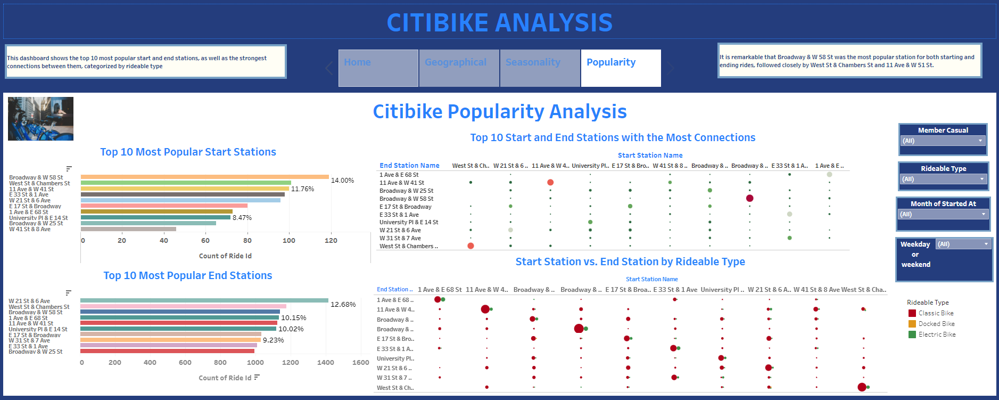

# Tableau-challenge

The Tableau challenge involves analyzing a sample dataset from 2023 provided by Citibike NYC. This analysis addresses two key phenomena:
1. Trends in Citibike usage monthly, weekly, and hourly, including station and rider type patterns.
2. Trends in the most popular start and end stations, including connections between them and usage by rideable type.

To explore these phenomena, I created a Tableau story that includes four dashboards:
**General Information:** This dashboard presents descriptive statistics such as total riders, trip duration in hours, total distance traveled, total stations, total start and end stations, and rider distribution. It also provides information on the average and median trip duration by rideable type. See the image below for more details.

**Geographical Analysis:** This map-based dashboard analyzes the average ride length, average trip duration in seconds, and rider count for each start station.

**Seasonality Analysis:** This dashboard reveals trends in the most popular hours and days when riders use the Citibike program or start their trips. It also indicates the most popular start stations by weekday or weekend and provides a monthly distance analysis and weekly rider type frequency.

**Citibike Popularity Analysis:** This dashboard examines the second phenomenon, focusing on Citibike popularity. It identifies the most popular start and end stations individually and their connections, categorized by rideable type.

Each dashboard includes four filters: rider type (member or casual), rideable type, month of trip start, and weekday or weekend.

You can view this challenge at the following Tableau link:

https://public.tableau.com/app/profile/isbelis.castro/viz/CITIBIKE-TABLEAU-CHALLENGE-18/CITIBIKEANALYSIS?publish=yes

This repository also contains the file `CITIBIKE-TABLEAU-CHALLENGE-18.twb`. Additionally, the `Resources` folder contains the sample dataset and its corresponding notebook.

I hope this project will be helpful for anyone interested in this topic or using Tableau for similar analyses.

# References: 
 - Citibike NYC System Data. https://citibikenyc.com/system-data
 -  2024 edX Boot Camps LLC